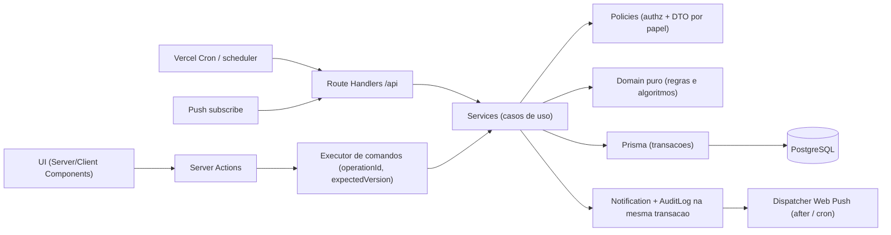
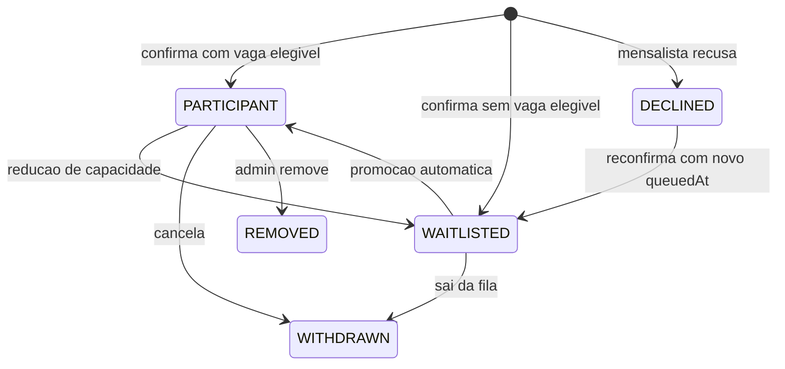
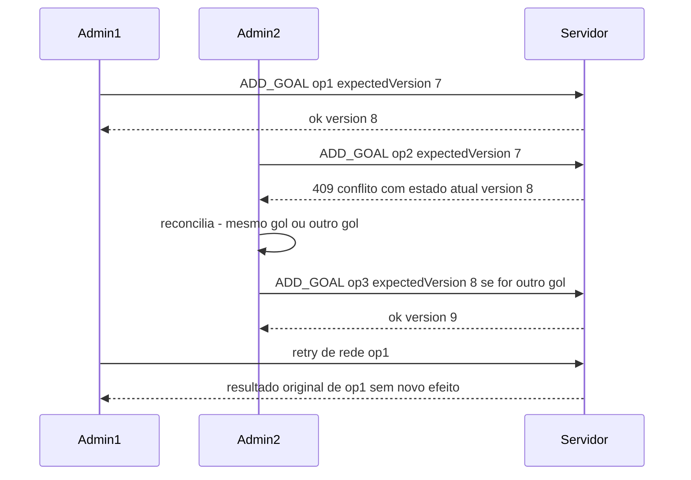
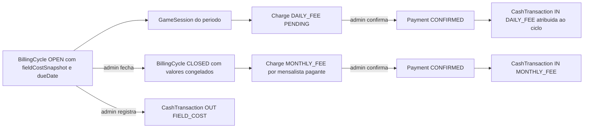
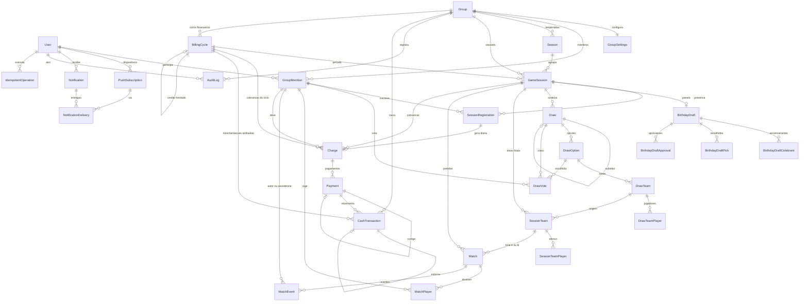

# Arquitetura - Sistema de Gestão da Pelada (Revisão 4 - planejamento estrutural encerrado)

O `PROJECT.md` continua sendo a fonte de verdade das regras. Este plano descreve como modelá-las.

- Revisão 1: seções 3, 4, 8, 11, 15, 21, 24, 25, 27, 30 e 31 do `PROJECT.md`.
- Revisão 2 (ciclo financeiro, campo mensal, mensalidade congelada, pagamento do campo): seções 4 e 31.
- Revisão 3 (arredondamento para cima, pagamento atrasado, vencimento no próprio mês, fechamento manual, saldo inicial): seção 31.
- Revisão 4 (presença real e cobrança só de PRESENT, intervenção na fila, FIXED_TEAMS/FLEXIBLE_ROTATION, criação/cancelamento de sessões, confirmações financeiras): seções 6, 11, 12, 24, 29 e 31.
- Revisão 5 (mensalidade independente da presença, capacidade na intervenção, destinatários de SESSION_CANCELLED, antecedência de 7 dias): seções 6, 11, 29 e 31.8.
- Revisão 6 (correção de presença cancela e reativa a mesma cobrança de diária): seção 31.5.

## 1. Arquitetura da aplicação

**Recomendação: monolito modular em Next.js (App Router)**, com regras de negócio isoladas em uma camada de domínio pura (TypeScript sem Next/Prisma), uma camada de serviços (casos de uso) e a UI apenas consumindo serviços.



Estrutura de pastas sugerida:

```
src/
  app/                    # rotas, layouts, páginas (player e admin), manifest.ts
    (auth)/login, (auth)/change-password
    (app)/...             # área do jogador (rankings, caixa, sessão)
    (app)/admin/...       # área admin
    (app)/admin/live      # Modo Pelada
    api/cron/[job]/route.ts
    api/push/route.ts
  domain/                 # PURO: sem imports de next/prisma; 100% testável (Vitest)
    presence/allocate.ts
    teams/strength.ts     # interface StrengthProvider
    teams/balance.ts      # gerador de opções equilibradas
    teams/partitionDistance.ts
    kingOfTheTable/rotation.ts
    stats/compute.ts
    finance/monthlyFee.ts # previsão/fechamento da mensalidade e divisão em centavos
    finance/cycleDates.ts # referência, período e dueDate do ciclo
    schedule/sessionDates.ts
  server/
    db.ts
    auth/
    commands/             # executor idempotente + versionamento otimista
    modules/<modulo>/     # service.ts, policy.ts, schemas.ts (zod), queries.ts, dto.ts
  components/
  lib/
```

Decisões e trade-offs:

- **Server Actions vs API REST**: Server Actions para mutações da UI e Route Handlers para cron, push e futuras integrações. Ambos chamam os mesmos services.
- **Autenticação** (decidido na Revisão 7): implementação própria, sem Better Auth, Auth.js ou OAuth. `User.passwordHash` (argon2id), senha temporária individual e aleatória, `mustChangePassword`, e `AuthSession` com `tokenHash` (o cookie HttpOnly carrega o token aleatório; o banco guarda só o hash), `expiresAt`, `lastUsedAt` e `revokedAt`. A redefinição pelo admin revoga as sessões ativas. Requisitos originais, todos mantidos:
  - login só por username;
  - cadastro público desligado (contas criadas só por ADMIN);
  - admin define senha temporária;
  - flag `mustChangePassword` bloqueando o uso até a troca.
  - O `proxy.ts` faz só checagem otimista; a autorização real fica nos services.
- **Validação**: Zod nos limites; invariantes revalidadas no service dentro da transação.
- **Concorrência**: três mecanismos, conforme o caso.
  - Presença: lock da linha da sessão (`SELECT ... FOR UPDATE`).
  - Modo Pelada: versionamento otimista da Match.
  - Financeiro e Panela de Aniversário: updates condicionais por status/versão.
  - Idempotência por `operationId` para todos os comandos relevantes (seção 6).
- **Tempo real no Modo Pelada**: com vários admins operando, cada tela de admin faz polling curto (2-3s) e sempre recebe o estado mais recente (com `version`) na resposta de cada comando. Espectadores fazem polling de 5-10s. Pusher/Ably entram só se o polling não bastar.
- **Cronômetro**: persistir `startedAt`, `pausedAt` e `pausedTotalMs`; o tempo decorrido é calculado no cliente.
- **PWA**: `app/manifest.ts` + service worker (Serwist ou SW manual) + Web Push com VAPID. No iOS, push exige o PWA instalado.
- **Banco na Vercel**: Postgres gerenciado (Neon, Supabase ou Prisma Postgres) com URL pooled para runtime e URL direta para migrations.
- **Fuso horário**: `timestamptz` em UTC; `Group.timezone = America/Sao_Paulo`.
- **Dinheiro**: valores em **centavos inteiros** (`Int`). Trade-off: `Decimal` do Prisma é exato, mas devolve objetos Decimal.js incômodos na UI e nos testes. Centavos inteiros são exatos e simples. A formatação em reais fica só na apresentação.
- **Visibilidade por papel**: cada módulo expõe DTOs separados (`toPlayerDTO`/`toAdminDTO`). `baseRating`, `strengthSnapshot`, `strengthTotal` e `balanceScore` nunca saem do servidor para um PLAYER.

## 2. Domínios / módulos

- **identity**: User, login, troca de senha obrigatória, redefinição por admin.
- **group**: Group, membros (role, modalidade, nota, isenção financeira), configurações.
- **season**: temporadas.
- **gameSession**: ciclo de vida da sessão e snapshot de configuração.
- **presence**: confirmação, recusa, lista de espera, promoção automática, prazo dos mensalistas, FIXED_TEAMS/FLEXIBLE_ROTATION.
- **birthdayDraft**: Panela de Aniversário.
- **draw**: sorteios, opções (com diversidade mínima), invalidação/refação, votação.
- **teams/strength** (domínio puro): StrengthProvider, balanceamento, distância entre partições.
- **match**: times finais, partidas, participações, goleiros, eventos, Rei da Mesa, comandos concorrentes.
- **stats**: estatísticas e rankings (visíveis a todos).
- **finance** (MVP): ciclos financeiros, cobranças (diárias e mensalidades), pagamentos, movimentações de caixa (incluindo o pagamento do campo), previsão e fechamento da mensalidade. Não importa nada de presence; recebe apenas "sessão X finalizada com estes participantes diaristas".
- **notification**: inscrições push, notificações, entregas, outbox.
- **audit**: AuditLog append-only.
- **commands**: registro de idempotência e executor com versionamento.
- **scheduler**: jobs idempotentes.

## 3. e 4. Entidades, responsabilidades e relacionamentos

### Identidade e grupo

- **User**: identidade global (username, nome, `birthDate` opcional, `mustChangePassword`, `disabledAt`, `createdByUserId`). Tem 1:N GroupMember, PushSubscription e Notification.
- **AuthSession** (própria): sessões de login com `tokenHash`, `expiresAt`, `lastUsedAt`, `revokedAt`. A redefinição de senha pelo admin revoga as sessões ativas do usuário. Contas OAuth ficam para o futuro.
- **Group**: a pelada (nome, slug, timezone). Hoje tem uma única linha (seed).
- **GroupSettings** (1:1 com Group), em colunas tipadas:
  - agenda: dia da semana, início/fim, minutos extras, abertura da lista e prazo dos mensalistas (dias antes + hora);
  - formato: `maxPlayers` (20), `teamSize` (5), `matchDurationSec` (**420 = 7 min**), `drawOptionsCount` (2), `drawMinOptionDifference` (3);
  - financeiro: `dailyFeeCents` (1500), `monthlyFieldCostCents` (90000, custo **mensal**), `fieldPaymentDueDay` (10), `currency` (BRL);
  - local;
  - `sessionAutoCreateLeadDays`: com quantos dias de antecedência a sessão automática é criada.
  - Toda alteração gera AuditLog com before/after.
- **GroupMember**: vínculo User x Group com `role`, `modality`, `baseRating` (só ADMIN lê/escreve), apelido, `status`, mais **isenção financeira explícita**: `feeExempt`, `feeExemptReason`, `feeExemptUpdatedAt`. Unique (groupId, userId).
  - Trade-off da isenção: um booleano no membro é simples e o histórico fica no AuditLog. Uma tabela de períodos (`FeeExemption` com validFrom/validTo) só se justifica quando houver cobrança de mensalidade por mês. Recomendo o booleano no MVP.

### Temporada e sessão

- **Season**: groupId, nome, `startsOn`, `endsOn`. Tem 1:N GameSession.
- **GameSession**: groupId, seasonId, `**billingCycleId`** (atribuído na criação, como a temporada, e não derivado de datas depois), `status`, `type`, e o **snapshot da configuração\*\*: `startsAt`, `endsAt`, `registrationOpensAt`, `priorityDeadlineAt`, `maxPlayers`, `teamSize`, `matchDurationSec`, `drawOptionsCount`, `drawMinOptionDifference`, `dailyFeeCents`. Também guarda:
  - `**origin**` (AUTOMATIC ou EXTRAORDINARY) e `scheduledFor`. Unique (groupId, scheduledFor) para AUTOMATIC, mesmo se cancelada, para que o job nunca recrie uma sessão cancelada;
  - **cancelamento**: `cancelledAt`, `cancelledByUserId`, `cancelReason`;
  - `overflowMode`, `overflowDecidedAt`, `overflowDecidedByUserId`;
  - os marcadores idempotentes `openedAt`, `priorityClosedAt`, `chargesGeneratedAt`.

### Presença

- **SessionRegistration**: uma linha por membro por sessão. Unique (sessionId, memberId). Campos:
  - fila: `status`, `queuedAt` (fato original, imutável), `**queueSortAt**` (posição efetiva; igual a `queuedAt`, salvo intervenção), `priorityTier`, `modalitySnapshot`, `source`, `respondedAt`, `**promotedAt**`, `withdrawnAt`;
  - intervenção administrativa: `manualOverrideAt`, `manualOverrideByUserId`, `manualOverrideReason` (a última; o histórico completo com before/after fica no AuditLog);
  - rotativos: `isRotating`, `rotatingSetByUserId`, `rotatingSetAt`;
  - presença real: `**attendance**` (PRESENT, ABSENT ou nulo se não marcada), `attendanceMarkedAt`, `attendanceMarkedByUserId`.

### Panela de Aniversário

- **BirthdayDraft** (`version`, `status`, `finalizedAt`), **BirthdayDraftCelebrant**, **BirthdayDraftPick**, **BirthdayDraftApproval** (memberId, `version`). Uma aprovação só vale para a `version` atual. Aprovar exige `expectedVersion`, o mesmo padrão otimista do Modo Pelada.

### Sorteio e votação

- **Draw**: sessionId, `sequence`, `status`, `decisionMethod`, `winningOptionId`, `seed`, `algorithmVersion`, `**minOptionDifference`** (snapshot), `**optionDistance\*\*`(distância calculada entre A e B, snapshot), dados da panela, autoria/invalidação,`replacesDrawId`.
- **DrawOption** (`label`, `balanceScore`), **DrawTeam** (`kind`, `strengthTotal`), **DrawTeamPlayer** (`strengthSnapshot`), **DrawVote** (unique drawId + voter). Os campos de força são só para ADMIN.

### Times finais, partidas e eventos

- **SessionTeam** / **SessionTeamPlayer**: times efetivos copiados da opção vencedora.
- **Match**: sessionId, `sequence`, `teamAId`, `teamBId`, `status`, tempos, `plannedDurationSec` (snapshot), `penaltyWinnerTeamId`, `**version`\*\* (inteiro incrementado a cada comando aceito).
- **MatchPlayer**: quem jogou cada partida (`role` FIELD/GOALKEEPER).
- **MatchEvent**: `type`, `**memberId` obrigatório\*\* (autor, para GOAL, OWN_GOAL e BIG_MISS), `teamId`, `assistMemberId` opcional (só em GOAL), `elapsedSec`, `createdByUserId`, `operationId`, campos de anulação (`voidedAt`, `voidedByUserId`, `voidReason`).

### Financeiro

- **BillingCycle** (ciclo financeiro mensal, novo na Revisão 2):
  - identificação: groupId, `referenceMonth` (por exemplo 2026-10; unique por grupo), `periodStart` e `periodEnd` (intervalo de datas das sessões atribuídas ao ciclo);
  - ciclo de vida: `status` (OPEN/CLOSED), `openedAt`, `closedAt`, `closedByUserId`;
  - `**dueDate**` (dia `fieldPaymentDueDay` do **próprio mês** de referência, calculado na abertura; por exemplo, outubro/2026 → 2026-10-10);
  - `**fieldCostSnapshotCents**` (gravado na abertura a partir de `monthlyFieldCostCents`);
  - valores congelados no fechamento (nulos enquanto OPEN):
    - `eligibleDailyRevenueCents`: líquido de DAILY_FEE atribuído ao ciclo;
    - `carriedCreditCents` e `carriedFromCycleId`: crédito de arredondamento herdado do ciclo anterior;
    - `**amountToSplitCents**` (valor exato a ser dividido) = `fieldCostSnapshotCents − eligibleDailyRevenueCents − carriedCreditCents`;
    - `**payingMonthlyCount**` (quantidade de pagantes);
    - `**monthlyFeeCents**` (valor individual arredondado para cima);
    - `**totalChargedCents**` (total efetivamente cobrado) = `monthlyFeeCents × payingMonthlyCount`;
    - `**roundingDifferenceCents**` (diferença de arredondamento) = `totalChargedCents − amountToSplitCents`, sempre entre 0 e `payingMonthlyCount − 1`. Vira o `carriedCreditCents` do ciclo seguinte.
- **Charge** (cobrança/obrigação):
  - groupId, memberId, `**billingCycleId**` (obrigatório), `type` (DAILY_FEE ou MONTHLY_FEE);
  - `gameSessionId` e `sessionRegistrationId`, só em DAILY_FEE. Unique em `sessionRegistrationId` garante uma cobrança por participação. Unique (billingCycleId, memberId) para MONTHLY_FEE, via índice parcial;
  - `**amountCents**` (snapshot da diária da sessão ou da mensalidade congelada do ciclo), `status`;
  - `createdByUserId` (nulo = SYSTEM), `cancelledAt`, `cancelledByUserId`, `cancelReason`.
- **Payment** (pagamento de uma cobrança): chargeId, memberId, `amountCents`, `**paidAt`** (quando o jogador pagou), `**confirmedAt**`e`**confirmedByUserId\*\*`(ADMIN),`method`opcional,`notes`opcional,`status`(CONFIRMED/REVERSED),`reversedAt`, `reversedByUserId`, `reversalReason`, `correctsPaymentId`.
- **CashTransaction** (movimentação do caixa, ledger append-only):
  - groupId, `**billingCycleId**` (obrigatório: o ciclo ao qual a movimentação foi **atribuída**, gravado no momento do lançamento);
  - `direction` (IN/OUT), `amountCents` (positivo), `category` (DAILY_FEE, MONTHLY_FEE, FIELD_COST, INITIAL_BALANCE);
  - `reason` (obrigatório em INITIAL_BALANCE e em estornos);
  - `occurredAt` (data real do dinheiro), `recordedAt`;
  - `paymentId` (nas entradas de cobranças; nulo no pagamento do campo), `gameSessionId` (histórico por sessão);
  - `reversesTransactionId` (unique; o estorno é um lançamento da mesma categoria com direção oposta);
  - `method` e `notes` opcionais, `createdByUserId`.
- O **pagamento do campo** não ganha uma entidade própria: é um CashTransaction OUT/FIELD_COST vinculado ao ciclo. "Campo pago" é calculado comparando o líquido de FIELD_COST do ciclo com `fieldCostSnapshotCents`. Trade-off: uma entidade "conta a pagar" seria simétrica a Charge, mas com um único fornecedor e um valor por mês não acrescenta informação.

Rastreabilidade:

- GameSession → SessionRegistration (diarista PRESENT) → Charge DAILY_FEE → Payment → CashTransaction IN.
- BillingCycle → Charge DAILY_FEE → Payment → CashTransaction IN.
- BillingCycle → Charge MONTHLY_FEE → Payment → CashTransaction IN.
- BillingCycle → CashTransaction OUT FIELD_COST.
- Pagamento atrasado de diária: Charge e Payment ficam no ciclo de origem; só a CashTransaction aponta para o ciclo aberto atual.

O saldo do caixa nunca é armazenado; o saldo inicial é uma CashTransaction IN/INITIAL_BALANCE.

### Comandos, notificações e auditoria

- **IdempotentOperation** (novo): `operationId` (UUID, PK), groupId, `actorUserId`, `commandType`, `requestHash`, `targetType`/`targetId`, `resultJson`, `createdAt`. Gravado na mesma transação do efeito. Expurgado após N dias.
- **PushSubscription**, **Notification** (`dedupeKey` unique), **NotificationDelivery**: sem mudanças.
- **AuditLog**: sem mudanças estruturais. `metadata` passa a carregar `operationId`, `expectedVersion` e `newVersion` quando houver.

## 5. Enums

Enums no banco:

- `MemberRole`: ADMIN, PLAYER
- `PlayerModality`: MONTHLY, DAILY
- `MemberStatus`: ACTIVE, INACTIVE
- `GameSessionStatus`: SCHEDULED, OPEN, LOCKED, IN_PROGRESS, FINISHED, CANCELLED
- `GameSessionType`: NORMAL, BIRTHDAY_DRAFT
- `GameSessionOrigin` (novo): AUTOMATIC, EXTRAORDINARY
- `AttendanceStatus` (novo): PRESENT, ABSENT
- `OverflowMode`: FIXED_TEAMS, FLEXIBLE_ROTATION
- `RegistrationStatus`: PARTICIPANT, WAITLISTED, DECLINED, WITHDRAWN, REMOVED
- `PriorityTier`: MONTHLY_PRIORITY, GENERAL
- `ActionSource`: SELF, ADMIN, SYSTEM
- `BirthdayDraftStatus`: BUILDING, FINALIZED, CANCELLED
- `DrawStatus`: VOTING, DECIDED, TIED, INVALIDATED
- `DrawDecisionMethod`: VOTE, SINGLE_OPTION, ADMIN_RESOLUTION
- `DrawTeamKind`: REGULAR, BIRTHDAY, ROTATION_POOL
- `SessionTeamOrigin`: DRAW, BIRTHDAY_DRAFT, MANUAL
- `MatchStatus`: IN_PROGRESS, FINISHED, CANCELLED
- `MatchPlayerRole`: FIELD, GOALKEEPER
- `MatchEventType`: GOAL, OWN_GOAL, BIG_MISS
- `BillingCycleStatus` (novo): OPEN, CLOSED
- `ChargeType`: DAILY_FEE, MONTHLY_FEE
- `ChargeStatus`: PENDING, PAID, CANCELLED
- `PaymentStatus`: CONFIRMED, REVERSED
- `PaymentMethod` (opcional): CASH, PIX, BANK_TRANSFER, OTHER. Aqui PIX é só um rótulo da forma de pagamento, não integração.
- `CashDirection`: IN, OUT
- `CashCategory`: DAILY_FEE, MONTHLY_FEE, FIELD_COST, INITIAL_BALANCE. O estorno usa a mesma categoria com direção oposta + `reversesTransactionId`; assim o líquido por categoria é sempre Σ IN − Σ OUT.
- `NotificationType`: LIST_OPENED, MONTHLY_DECLINED, WAITLIST_PROMOTED, DAILY_PLAYERS_NEEDED, SESSION_CANCELLED
- `DeliveryStatus`: PENDING, SENT, FAILED, EXPIRED
- `ActorType`: USER, SYSTEM

Apenas em TypeScript: `AuditAction`, `AuditEntityType`, `CommandType`, `MatchOutcome`, `KingOfTheTableMode`.

## 6. Modelagem das regras críticas

### Presença e promoção automática

- Função pura `allocate(registrations, capacity, phase)` executada na transação (com lock da sessão) a cada mudança.
- **Toda liberação de vaga** (cancelamento, remoção, aumento de capacidade, prazo das 14:00) promove automaticamente o primeiro elegível da fila, sem aceite. Na mesma transação:
  - `status = PARTICIPANT` e `promotedAt = now()`;
  - AuditLog com actor SYSTEM;
  - Notification WAITLIST_PROMOTED no outbox.
- Elegibilidade:
  - antes do prazo, só `MONTHLY_PRIORITY` ocupa vaga;
  - depois do prazo, primeiro `MONTHLY_PRIORITY` por `queuedAt` e depois `GENERAL` por `queuedAt`. Interpretação adotada a partir do §10 do `PROJECT.md`: só perde a prioridade o mensalista que não confirmou até o prazo.
- A alocação é estável: participante só volta para a fila em caso de redução de capacidade (FIXED_TEAMS), na ordem inversa de prioridade.
- `modalitySnapshot` e `priorityTier` são gravados no momento da confirmação. A quantidade de mensalistas nunca aparece como constante; vem sempre de consulta a membros ativos.



### Intervenção administrativa na fila

- Comandos de ADMIN (`operationId`, `reason` obrigatório): incluir como participante, remover (status REMOVED) e reposicionar na fila.
- Reposicionar altera `queueSortAt` e, se necessário, `priorityTier`. Nunca altera `queuedAt`, que é o fato original.
- A função `allocate` ordena por (`priorityTier`, `queueSortAt`, id) e é estável: participante incluído pelo admin não é rebaixado por recálculos automáticos.
- Cada intervenção grava AuditLog com actor, timestamp, before/after da inscrição e reason, além dos campos `manualOverride*` na inscrição.
- Intervenções que liberam vaga (remoção) disparam a promoção automática normal.
- Uma intervenção nunca deixa a sessão acima da capacidade efetiva. Com a sessão cheia, incluir alguém exige, no mesmo comando, remover ou reposicionar outro participante; caso contrário o comando é rejeitado.

### FIXED_TEAMS e FLEXIBLE_ROTATION (16 a 19 participantes)

- **Pré-condições do comando `setOverflowMode`** (ADMIN):
  - `priorityClosedAt` preenchido, ou seja, depois do deadline;
  - entre 16 e 19 participantes;
  - nenhum Draw ativo (não invalidado) na sessão. Isso implementa "alterável até o sorteio"; invalidar o sorteio reabre a escolha.
- **FIXED_TEAMS**: a capacidade efetiva vira 15. `allocate` devolve os excedentes para WAITLISTED na ordem inversa de prioridade (diaristas mais recentes primeiro). Eles continuam na fila e podem ser promovidos se surgir vaga.
- **FLEXIBLE_ROTATION**: a capacidade continua `maxPlayers`.
  - O ADMIN marca os rotativos (`isRotating`), com AuditLog.
  - O sorteio só é permitido quando a quantidade de rotativos for igual a participantes − 15.
  - Os rotativos formam o bloco ROTATION_POOL, idêntico nas duas opções; o algoritmo só balanceia os 15 restantes.
  - Ajustes depois do sorteio são feitos nos times finais (SessionTeamPlayer com papel ROTATING), com AuditLog.
- **Voltar de FIXED para FLEXIBLE** restaura a capacidade e promove automaticamente da fila, pela regra geral de promoção.
- **Menos de 15 participantes**: nenhum comportamento automático; o sorteio automático é bloqueado. Os mecanismos disponíveis ao ADMIN são montar os times manualmente (SessionTeam com origem MANUAL) ou cancelar a sessão.

### Ciclo de vida das sessões

- **Automática**: o job `ensureUpcomingSession` cria a próxima sessão quando `registrationOpensAt − sessionAutoCreateLeadDays <= now`, com `origin = AUTOMATIC`. Usa `GroupSettings` para dia, horário, abertura (por exemplo, segunda 08:00), deadline (quinta 14:00) e os snapshots. Atribui `seasonId` e `billingCycleId` e grava AuditLog com actor SYSTEM.
- **Extraordinária**: comando de ADMIN com data/hora e, opcionalmente, overrides de abertura, deadline e capacidade (padrões vindos de `GroupSettings`); `origin = EXTRAORDINARY`, com AuditLog. Segue o mesmo fluxo da sessão normal.
- **Cancelamento**: comando de ADMIN (`operationId`, `reason` obrigatório), em uma transação:
  - update condicional para `status = CANCELLED` (só se não estiver FINISHED), com `cancelledAt`, `cancelledByUserId` e `cancelReason`;
  - AuditLog;
  - Notification SESSION_CANCELLED no outbox para todos os membros ativos.
  - Depois disso, jobs e services rejeitam ou ignoram a sessão: não há abertura, deadline, promoções, sorteio, votação, partidas nem cobranças. O histórico é preservado.

### Diversidade entre opções de sorteio (comparação de partições)

Uma opção é uma partição dos jogadores sorteados em blocos (times). Os rótulos dos times são arbitrários, então a comparação precisa ser invariante a permutações.

- Conjunto comparado: jogadores sorteados, excluindo a Panela de Aniversário fixa, que é idêntica nas duas opções.
- O bloco ROTATION_POOL (rotativos definidos pelo ADMIN em FLEXIBLE_ROTATION) é idêntico nas duas opções e também fica fora da comparação. Só os times REGULAR são comparados.
- Matriz de sobreposição: `M[i][j] = |P_i ∩ Q_j|` (jogadores em comum entre o time i da opção P e o time j da opção Q).
- Melhor alinhamento: `σ* = argmax_σ Σ_i M[i][σ(i)]` sobre as permutações dos times. Com até 4 times são no máximo 24 permutações, então força bruta resolve; para k maior, algoritmo húngaro.
- **Distância**: `d(P, Q) = N − Σ_i M[i][σ*(i)]`, que é o número mínimo de jogadores que precisam mudar de time para transformar P em Q. `d = 0` se e somente se as opções forem a mesma partição com outros rótulos.
- Regra: aceitar o par (A, B) somente se `d(A, B) >= drawMinOptionDifference` (snapshot, padrão 3).
- Exemplos:
  - trocar só os nomes ou cores dos times: d = 0 (rejeitado);
  - uma única troca de dois jogadores entre dois times: d = 2 (rejeitado);
  - rotação de 3 jogadores entre 3 times: d = 3 (aceito);
  - duas trocas independentes: d = 4 (aceito).
- Deduplicação rápida de candidatos: forma canônica (ids ordenados dentro de cada time, times ordenados lexicograficamente, depois hash).
- Geração: produzir um conjunto de candidatos bem equilibrados, escolher o melhor como A e o melhor B com `d(A, B) >= mínimo`. Se não existir B válido, o sorteio falha com erro explícito para o admin, sem relaxar a regra em silêncio.
- `optionDistance` é persistido no Draw para auditoria.

### Sorteios, votação e Panela de Aniversário

Sem mudanças de regra em relação à versão anterior:

- Draw imutável; refação com `replacesDrawId` e votos do zero.
- Votação restrita a mensalistas participantes; empate fica TIED com resolução registrada pelo admin.
- Panela versionada; aprovação vale só para a versão atual.
- Telas de PLAYER mostram composição dos times e votos, nunca força.

### Concorrência no Modo Pelada (múltiplos admins)

Comando típico:

```ts
{ operationId: uuid, matchId, expectedVersion: 7, type: "ADD_GOAL", payload: { memberId, assistMemberId?: string | null } }
```

Ordem de processamento no executor, em uma transação:

1. **Idempotência**: se `operationId` já existe em `IdempotentOperation`:

- mesmo ator e mesmo `requestHash`: devolve o `resultJson` original (duplo clique, retry de rede, reenvio);
- payload diferente: rejeita com 422.
- Essa checagem vem antes da versão, para que um retry de um comando que já teve sucesso não vire conflito falso.

2. **Versão**: `UPDATE match SET version = version + 1 WHERE id = ? AND version = expectedVersion`.

- Com 0 linhas afetadas: **conflito (409)**. Nada é gravado, nem o registro de idempotência; a resposta traz o estado atual da partida (placar, eventos, `version`).

3. **Regras**: validações de domínio. Exemplos: autor obrigatório e MatchPlayer do time; assistente do mesmo time e diferente do autor; partida IN_PROGRESS para registrar evento.
4. **Efeito**: grava o evento ou a alteração, mais `IdempotentOperation` com o resultado e AuditLog com `operationId`, `expectedVersion` e `newVersion`.
5. **Resposta**: novo estado completo da partida com a nova `version`.

Reconciliação no cliente: ao receber 409, a tela atualiza e mostra o que mudou desde a versão que o admin via (diff entre o estado local anterior e o atual; por exemplo, "Admin X registrou gol de Fulano"). O admin escolhe:

- descartar, quando era o mesmo gol;
- reenviar conscientemente, quando foi outro gol. O reenvio usa **novo operationId**, porque é uma nova decisão humana, e o `expectedVersion` atual.

Conflitos também geram AuditLog (`MATCH_COMMAND_CONFLICT`) em transação separada.

Nenhuma heurística de tempo é usada, então dois gols legítimos seguidos funcionam naturalmente: o segundo comando parte da versão que já inclui o primeiro.

Comandos que incrementam `Match.version`: iniciar, pausar, retomar e finalizar partida; adicionar, editar e anular evento; alterar jogadores ou goleiros; registrar vencedor nos pênaltis. Correções em partidas já finalizadas seguem o mesmo fluxo.

Comando no nível da sessão, "iniciar próxima partida":

- unique (gameSessionId, `sequence`);
- índice único parcial "no máximo uma partida IN_PROGRESS por sessão" (via SQL na migration);
- o comando carrega o `sequence` esperado. Se dois admins iniciarem ao mesmo tempo, o segundo recebe conflito.



O mesmo executor (`operationId` obrigatório) é usado em confirmação de presença, intervenções na fila, votação, geração de sorteio, aprovação da panela, cancelamento de sessão e comandos financeiros.

**Presença real no Modo Pelada**:

- Comando `markAttendance` (ADMIN, `operationId`) define `attendance` PRESENT ou ABSENT em uma inscrição PARTICIPANT, com AuditLog.
- Concorrência entre admins por update condicional com o valor anterior esperado: se o valor mudou, o comando recebe conflito e o estado atual.
- Se o jogador apareceu sem estar na lista, o admin primeiro o inclui (intervenção com reason) e depois marca PRESENT.

### Eventos individuais

- `memberId` obrigatório (NOT NULL) para todos os tipos. `assistMemberId` é nullable e só é aceito em GOAL.
- OWN_GOAL credita o placar do adversário (calculado).
- Correção por edição ou anulação, sempre com AuditLog e via `Match.version`.

### Financeiro



**Ciclo de vida do BillingCycle**

- **Abertura** (job idempotente `ensureBillingCycle`, unique (groupId, referenceMonth)):
  - cria o ciclo do mês com `status = OPEN`, `openedAt`, `periodStart`/`periodEnd` (mês civil das sessões no fuso do grupo);
  - grava `fieldCostSnapshotCents` a partir de `monthlyFieldCostCents`;
  - grava `dueDate` = dia `fieldPaymentDueDay` do próprio mês de referência. Se o dia não existir no mês, usa o último dia.
  - Cada GameSession recebe o `billingCycleId` do ciclo do seu período na criação.
  - Pode haver dois ciclos OPEN ao mesmo tempo (o mês anterior ainda não fechado e o mês corrente).
- **Mudança de configuração**: alterar `monthlyFieldCostCents` ou `fieldPaymentDueDay` vale para ciclos abertos depois. Ajustar o snapshot de um ciclo OPEN é um comando explícito do admin, com AuditLog. Ciclo CLOSED nunca é alterado nem recalculado.
- **Previsão dinâmica** (enquanto OPEN, calculada; função pura `domain/finance/monthlyFee.ts`):
  - `eligible` = líquido de DAILY_FEE (Σ IN − Σ OUT) com `billingCycleId` = ciclo;
  - `credit` = `roundingDifferenceCents` do ciclo anterior fechado (0 se não houver);
  - `amountToSplit = fieldCostSnapshotCents − eligible − credit`;
  - `payingCount` = membros ativos, MONTHLY, `feeExempt = false`, no momento da consulta;
  - valor individual com arredondamento para cima.
  - A tela exibe "PREVISÃO" e a fórmula com os valores reais. Com `payingCount = 0`, mostra "indisponível".
- **Fechamento** (comando manual de ADMIN, transacional e idempotente):
  1. Idempotência pelo `operationId`: um reenvio devolve o resultado original.
  2. Pré-condições:
  - o ciclo é o OPEN mais antigo do grupo (fechamento sequencial, garantindo que o crédito herdado do anterior já está congelado);
  - `payingCount > 0` (caso contrário, erro explícito);
  - existe um ciclo OPEN posterior; se não existir, é criado na mesma transação, para receber pagamentos atrasados.
  3. Update condicional `status = CLOSED, closedAt = now(), closedByUserId WHERE id = ? AND status = OPEN`. Com 0 linhas afetadas, o ciclo já estava fechado e nada mais é feito.
  4. Determina os mensalistas ativos não isentos e calcula com a mesma função pura da previsão.
  5. Congela `eligibleDailyRevenueCents`, `carriedCreditCents`, `carriedFromCycleId`, `amountToSplitCents`, `payingMonthlyCount`, `monthlyFeeCents`, `totalChargedCents` e `roundingDifferenceCents`.
  6. Cria uma Charge MONTHLY_FEE PENDING por pagante, todas com `amountCents = monthlyFeeCents`. O índice único (billingCycleId, memberId) impede duplicação. O conjunto dessas cobranças é o registro explícito de quem foi considerado.
  7. Grava AuditLog com o cálculo completo e a lista de pagantes.
  - Depois de CLOSED, o ciclo continua recebendo pagamentos de mensalidade e o pagamento do campo (isso não altera os valores congelados), mas nunca mais recebe lançamentos DAILY_FEE.

**Arredondamento da mensalidade** (decidido): valor igual para todos, arredondado para cima ao centavo.

- Em inteiros: `monthlyFeeCents = ceil(amountToSplitCents / payingMonthlyCount)`, calculado como `floor((amountToSplitCents + payingMonthlyCount − 1) / payingMonthlyCount)`, sem ponto flutuante.
- Exemplo: 82500 / 19 → 4343. Total cobrado: 82517. Diferença: 17.
- Os 17 centavos ficam no caixa (o total cobrado é maior que o necessário) e entram como `carriedCreditCents` no ciclo seguinte, reduzindo o valor a dividir. Assim o excedente beneficia o próximo ciclo sem ser descartado nem contado duas vezes.

**Atribuição de movimentações ao ciclo** (sempre gravada em `CashTransaction.billingCycleId`, nunca derivada da data):

- Pagamento de diária: vai para o ciclo da cobrança se ele estiver OPEN. Se o ciclo da cobrança já fechou (pagamento atrasado, decidido), Charge e Payment continuam no ciclo de origem; a CashTransaction é atribuída ao ciclo OPEN mais antigo e reduz a próxima mensalidade; o ciclo fechado não é recalculado.
- Pagamento de mensalidade: sempre o ciclo da cobrança.
- Pagamento do campo: o ciclo informado pelo admin (padrão: o ciclo cujo `dueDate` está sendo pago).
- Saldo inicial: o ciclo OPEN mais antigo. Não entra na fórmula da mensalidade, que só considera DAILY_FEE e o crédito de arredondamento.
- Estornos seguem a regra da categoria. Um estorno de DAILY_FEE de ciclo fechado vai para o ciclo OPEN mais antigo.

**Pagamentos (diária e mensalidade)**

- **Geração das cobranças de diária** (decidido: só PRESENT):
  - ao finalizar a sessão, uma Charge DAILY_FEE por inscrição com `modalitySnapshot = DAILY` e `attendance = PRESENT`;
  - `amountCents = GameSession.dailyFeeCents` e `billingCycleId = GameSession.billingCycleId`;
  - idempotente: índice único em `sessionRegistrationId` + `chargesGeneratedAt`. Reprocessar nunca duplica.
  - Correção de presença depois de finalizada (Revisão 6), sempre na mesma Charge (unique em `sessionRegistrationId`):
    - PRESENT → ABSENT: update condicional `PENDING → CANCELLED` com `cancelledAt`, `cancelledByUserId` e `cancelReason` (obrigatório), mais AuditLog;
    - ABSENT → PRESENT: se a Charge existe e está CANCELLED, update condicional `CANCELLED → PENDING`, mantendo id, `amountCents` e `billingCycleId` originais, mais AuditLog com before/after (os dados do cancelamento ficam no AuditLog). Se a Charge ainda não existe (presença nunca foi PRESENT), ela é criada pelo caminho idempotente normal;
    - Charge PAID: o comando é rejeitado; primeiro o admin estorna o pagamento (a Charge volta para PENDING) e só então corrige a presença.
  - Confirmado na lista sem presença marcada não gera cobrança.
- **Confirmar pagamento** (ADMIN, `operationId`), em uma transação: update condicional da Charge para PAID (`WHERE status = PENDING`), Payment CONFIRMED (`paidAt`, `confirmedAt`, `confirmedByUserId`, `method`, `notes`), CashTransaction IN atribuída conforme a regra acima e AuditLog.
- **Estorno**: Payment REVERSED (sem apagar), CashTransaction com direção oposta e `reversesTransactionId`, Charge volta para PENDING, AuditLog.
- **Correção de valor ou data**: estorno + novo Payment com `correctsPaymentId`. `method` e `notes` podem ser editados, com AuditLog.
- **Cancelamento de cobrança**: só se PENDING, com motivo e AuditLog.

**Pagamento do campo**

- Comando de ADMIN (`operationId`) que cria CashTransaction OUT/FIELD_COST com `billingCycleId`, `occurredAt`, valor, `method`, `notes` e AuditLog. Correção por estorno + novo lançamento.
- Situação do campo no ciclo é calculada: pago, parcial, pendente ou vencido (`now > dueDate` sem pagamento completo).

**Saldo inicial**

- Comando de ADMIN (`operationId`) que cria uma CashTransaction IN/INITIAL_BALANCE com `reason` obrigatório e AuditLog.
- Regra de serviço: no máximo um INITIAL_BALANCE não estornado por grupo. Correção por estorno + novo lançamento.

**Saldo**

- O saldo nunca é armazenado.
- Saldo do caixa = Σ IN − Σ OUT de todas as movimentações, incluindo INITIAL_BALANCE.
- Saldo do ciclo = o mesmo filtrado por `billingCycleId`. No exemplo do `PROJECT.md`: +7500 de diárias, +82517 de mensalidades, −90000 do campo, saldo +17 (crédito do ciclo seguinte).

**Isenção e visibilidade**

- `GroupMember.feeExempt` só por ADMIN, com AuditLog; nenhuma regra usa `role`.
- Todas as consultas financeiras são liberadas a qualquer membro autenticado; todas as mutações exigem `requireAdmin`.

### Notificações e auditoria

- Outbox e `dedupeKey` como antes.
- Novas ações auditadas: criação de conta, redefinição de senha (sem a senha), troca obrigatória concluída, geração/cancelamento de cobrança, confirmação/correção/estorno de pagamento, abertura/fechamento de ciclo, ajuste de snapshot de ciclo aberto, registro/estorno do pagamento do campo, lançamento/estorno do saldo inicial, alteração de diária, custo do campo e dia de vencimento, isenção, conflitos de comando.

## 7. Persistido vs calculado

**Persistido (fonte da verdade):**

- usuários (incluindo `mustChangePassword`), membros (incluindo `feeExempt`), configurações
- temporadas, sessões
- inscrições (incluindo `promotedAt`)
- panela, sorteios, votos
- times, partidas (incluindo `version`), participações, eventos
- ciclos financeiros, cobranças, pagamentos, movimentações de caixa (incluindo o pagamento do campo)
- registros de idempotência, notificações, auditoria

**Snapshots persistidos:**

- configuração na GameSession (incluindo `dailyFeeCents`, `matchDurationSec` e `drawMinOptionDifference`)
- `modalitySnapshot` e `priorityTier`
- status de alocação materializado
- força, `balanceScore`, `seed`, `algorithmVersion`, `minOptionDifference` e `optionDistance` no Draw
- resultado da votação
- `Charge.amountCents` (diária da sessão ou mensalidade congelada)
- `Charge.status`, materializado na mesma transação do pagamento ou estorno
- `BillingCycle.fieldCostSnapshotCents` e `dueDate` (na abertura)
- valores do fechamento do ciclo: `eligibleDailyRevenueCents`, `carriedCreditCents`, `amountToSplitCents`, `payingMonthlyCount`, `monthlyFeeCents`, `totalChargedCents`, `roundingDifferenceCents`
- `CashTransaction.billingCycleId` (atribuição gravada, nunca recalculada)

**Calculado:**

- fase da lista, posição na fila, vagas, mensalistas sem resposta
- contagem de votos, estado de aprovação da panela, força atua
- placar, resultado, cronômetro, próxima partida, estatísticas e rankings
- **saldo do caixa** e **saldo do ciclo** (Σ das movimentações)
- **receitas prevista, recebida e pendente** (a partir das cobranças e pagamentos)
- quantidade de diaristas por sessão
- quantidade de mensalistas pagantes enquanto o ciclo está OPEN (no fechamento, vira valor congelado)
- **previsão da mensalidade** do ciclo aberto
- situação do pagamento do campo (pago, parcial, pendente, vencido)

## 8. Tarefas automáticas e Vercel

Jobs idempotentes, executados por `/api/cron/tick` com avaliação preguiçosa nas leituras:

- **ensureBillingCycle**: garante o BillingCycle OPEN do mês corrente e do mês da próxima sessão, com snapshot do custo mensal e `dueDate`.
- **ensureUpcomingSession**: cria a próxima GameSession AUTOMATIC dentro da antecedência configurada (`sessionAutoCreateLeadDays`), com snapshot (diária, duração de 7 min), `seasonId` e `billingCycleId`. É idempotente pelo unique (groupId, scheduledFor) e nunca recria sessão cancelada.
- **openRegistration**: abre a lista e dispara LIST_OPENED.
- **closeMonthlyPriority**: preenche a fila com promoções automáticas e WAITLIST_PROMOTED.
- **generateDailyFeeCharges**: disparado ao finalizar a sessão, só para diaristas PRESENT. O tick reprocessa sessões FINISHED com `chargesGeneratedAt IS NULL`.
- Todos os jobs ignoram sessões CANCELLED.
- **dispatchNotifications**: reenvio de push pendente ou falho.
- **housekeeping**: expurgo de `IdempotentOperation` antigos, sessões de auth expiradas e inscrições push inválidas.

Disparo do tick:

- Vercel Cron no plano Pro (precisão de minuto): recomendado.
- No Hobby, os crons são diários e imprecisos; alternativas são Upstash QStash agendando os horários exatos ou um cron externo chamando o tick com `CRON_SECRET`.

## 9. Preparação para SaaS

- `Group` existe desde já, com uma única linha; `groupId` fica nas raízes: GroupMember, GroupSettings, Season, GameSession, Notification, AuditLog e agora também **BillingCycle**, **Charge**, **CashTransaction** e **IdempotentOperation**.
- Role, modalidade, nota e isenção ficam em GroupMember (por grupo); dinheiro, ciclos e configuração financeira ficam por grupo.
- O ledger com entradas e saídas, cobranças tipadas e ciclos explícitos prepara gateway, PIX integrado e cobrança automática futuros sem reescrever o caixa.
- O grupo atual é resolvido em `getCurrentGroup()`; as policies sempre checam a membership.

## 10. Ambiguidades e decisões pendentes (revisadas)

Já decididas e removidas da lista anterior:

- promoção automática sem aceite;
- diaristas aguardam até o prazo;
- diversidade mínima das opções;
- gol sem autor;
- visibilidade das notas;
- criação de contas e recuperação de senha;
- múltiplos admins no Modo Pelada;
- duração da partida;
- quantidade de mensalistas;
- (Revisão 2) período de acumulação: BillingCycle mensal explícito;
- (Revisão 2) custo do campo: mensal, com vencimento configurável (dia 10);
- (Revisão 2) mensalidades e pagamento do campo fazem parte do caixa;
- (Revisão 3) arredondamento para cima, igual para todos, com a diferença no caixa;
- (Revisão 3) pagamento atrasado de diária vai para o ciclo aberto atual;
- (Revisão 3) vencimento no próprio mês do ciclo;
- (Revisão 3) fechamento manual por ADMIN, considerando os mensalistas ativos não isentos no momento do fechamento;
- (Revisão 3) saldo inicial via INITIAL_BALANCE;
- (Revisão 4) crédito de arredondamento, fechamento em ordem cronológica e INITIAL_BALANCE único confirmados;
- (Revisão 4) cobrança de diária só para diarista PRESENT;
- (Revisão 4) intervenção administrativa excepcional na fila;
- (Revisão 4) FIXED_TEAMS/FLEXIBLE_ROTATION, rotativos definidos pelo admin e menos de 15 participantes;
- (Revisão 4) criação automática, sessão extraordinária e cancelamento de sessões.
- (Revisão 5) mensalista paga independentemente da presença; intervenção administrativa nunca excede a capacidade (com sessão cheia, o admin remove ou reposiciona outro participante na mesma intervenção); SESSION_CANCELLED para todos os membros ativos; sessões automáticas criadas 7 dias antes da abertura da lista.

Interpretações adotadas sem pergunta, derivadas do `PROJECT.md` (corrija se discordar):

- o mensalista que confirmou antes do prazo e ficou na fila mantém prioridade sobre diaristas depois das 14:00;
- a modalidade vale pelo snapshot do momento da confirmação;
- as cobranças de mensalidade são geradas no fechamento do ciclo, com o valor congelado (o `PROJECT.md` §31.10 já registra isso).

### Bloqueiam o schema

Nenhuma. As perguntas abaixo afetam services, cálculos e telas; o schema proposto acomoda qualquer resposta.

### Precisam de resposta antes dos services correspondentes

Ficam em aberto por decisão do usuário; serão respondidas quando cada módulo for iniciado.

Financeiro:

1. **Valor a dividir zero ou negativo** (receitas de diaristas + crédito ≥ custo do campo): fechar sem cobranças de mensalidade e levar o excedente como crédito ao ciclo seguinte (proposta)?
2. **Visibilidade de nomes**: nomes de quem está com cobrança pendente são visíveis a todos ou só os totais?

Presença e sessões: 3, 4 e 5 resolvidas na Revisão 5 (a intervenção nunca excede a capacidade; SESSION_CANCELLED vai para todos os membros ativos; `sessionAutoCreateLeadDays` = 7).

Sorteio, votação e panela: 6. Quem dispara o sorteio e quando a lista trava? 7. Quando a votação abre e fecha? O voto pode ser alterado? O voto de quem cancela depois conta? 8. O que acontece com os times quando um participante cancela, ou alguém é promovido automaticamente, depois dos times definidos? 9. Como se identificam os aniversariantes e qual a janela? Pode haver 3 ou mais? Há prazo e possibilidade de intervenção do admin? O que acontece se um escolhido cancelar?

Partidas e estatísticas: 10. Critério da classificação geral (pontos, aproveitamento, mínimo de jogos, desempates). 11. Vitória nos pênaltis conta como vitória ou empate nas estatísticas? 12. Atuar como goleiro conta como partida jogada, vitória e derrota? 13. Ordem inicial dos times e primeiro confronto.

Operação: 14. Destinatários e gatilhos de MONTHLY_DECLINED e DAILY_PLAYERS_NEEDED. 15. O Modo Pelada precisa funcionar offline? O `operationId` gerado no cliente já prepara uma fila offline futura. 16. Plano da Vercel (Hobby ou Pro).

## 11. Modelo conceitual do banco



Observações do diagrama:

- `Charge` é DAILY_FEE (ligada a SessionRegistration e GameSession) ou MONTHLY_FEE (ligada só ao BillingCycle e ao membro).
- `CashTransaction` OUT/FIELD_COST e IN/INITIAL_BALANCE não têm Payment; ligam-se diretamente ao BillingCycle.
- `CashTransaction.billingCycleId` pode diferir de `Charge.billingCycleId` no pagamento atrasado de diária (regra decidida na Revisão 3).
- `BillingCycle.carriedFromCycleId` aponta o ciclo anterior cuja diferença de arredondamento foi herdada como crédito.
